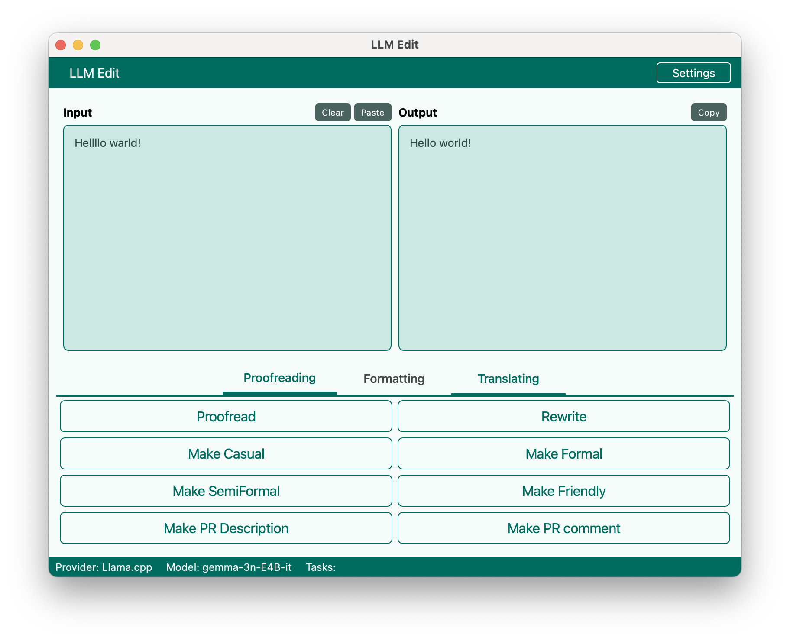
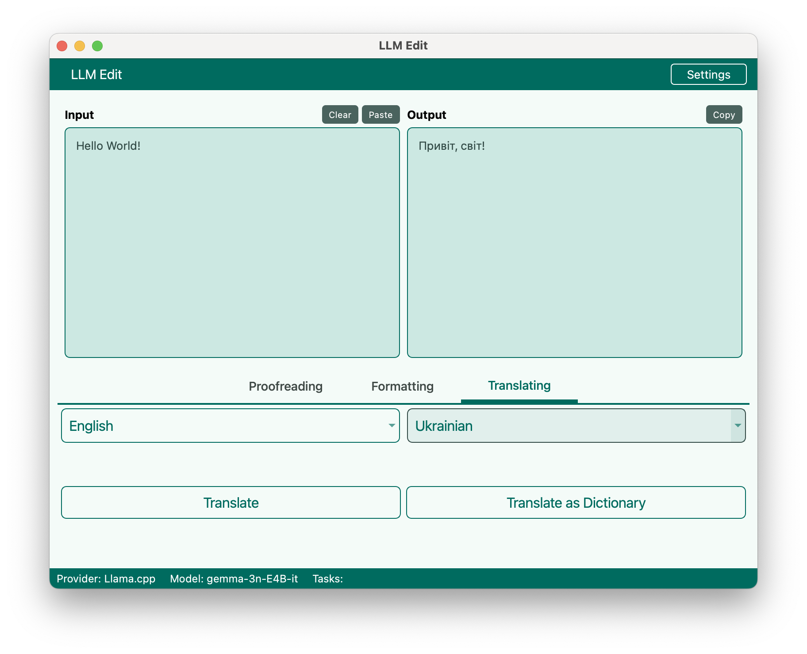
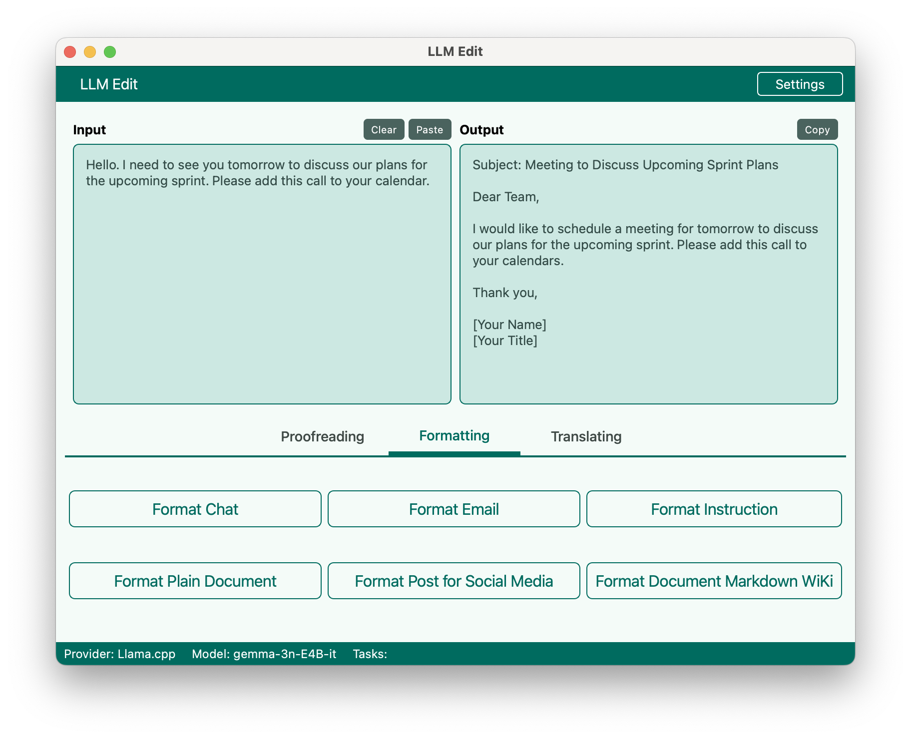
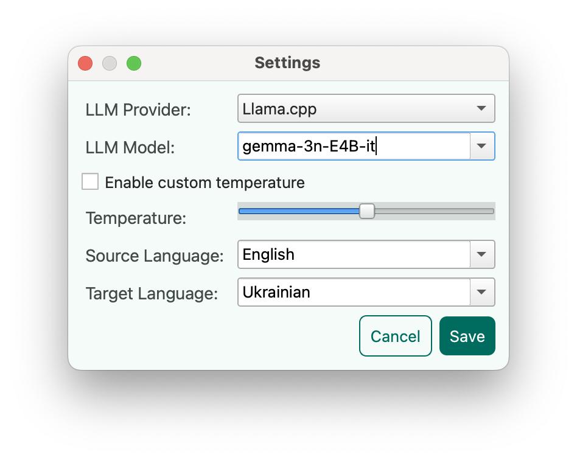

# llmedit

**Local LLM Toolkit for Text Editing & Translation**

  
*Main interface showing text correction capabilities*

## Overview

A GUI-based application for text processing with local Large Language Models (LLMs). It supports proofreading, style
adjustments, formatting, and translation—all offline.

## Key Features

✅ **Text Processing**

- Proofreading and grammar correction
- Style transformation (formal, casual, friendly)
- Document formatting for emails, PRs, and social media

✅ **Translation**

- Bidirectional language translation
- Dictionary-style translations

✅ **Model Flexibility**

- Uses GGUF-formatted models via `llama.cpp`
- Integrates with [Ollama](https://ollama.com/) (if installed)

  
*Translation tab with language selection*

## System Requirements

| Category     | Requirement                                        |
|--------------|----------------------------------------------------|
| OS           | macOS (tested on M1), Linux, Windows               |
| Python       | ≥ 3.10 (tested with 3.13.5)                        |
| Dependencies | Poetry ≥ 2.1.3                                     |
| Chip         | Any powerful CPU/GPU (e.g., Apple Silicon, NVIDIA) |

## Supported Models

The pre-configured GGUF models include:

- DeepSeek-R1-Distill-Llama-8B
- Qwen3-14B
- Gemma-3n-E4B-it  
  *(Full list in `scripts/download_models.py`)*

## Quick Start

```bash
git clone https://github.com/sanyokkua/llmedit.git
cd llmedit
poetry install
poetry run python scripts/download_models.py  # Select a model
poetry run llmedit
```

  
*Email formatting demonstration*

  
*Settings demonstration*

## Performance Notes

- First-run delays occur during model loading.
- GPU acceleration requires recompiling `llama.cpp` (scripts provided).
- The UI freezes during inference to prevent task interruption.

## Model Recommendations

### Provider Selection

- Prefer the `llama.cpp` provider for continuous usage, as models remain loaded in memory after initial startup.
- The Ollama provider may unload models after periods of inactivity, requiring reloading.
- Use Ollama when you need models not available in the preconfigured `llama.cpp` list.

### Model Size Guidance

- Larger models generally produce higher-quality results.
- The minimum viable size depends on your hardware capabilities.
- Balance model size with available system resources.

### Translation-Specific Recommendations

For European language translation (e.g., English, Ukrainian, Croatian):

- `gemma-3n-E4B-it` – Good baseline performance.
- `gemma-3-27b-it-qat` – Better results for complex translations.
- `Qwen3-30B-A3B-Instruct-2506` – Alternative high-quality option.
- `Mistral-Small-3.2-24B-Instruct-2506` – EU-developed model with strong European language support.

### Language Support Notes

- English generally has the best model support across all LLMs.
- Spanish, German, and other major European languages perform well.
- Model language capabilities vary; experimentation is recommended for specific language pairs.
- Quality depends on both model architecture and training data coverage for target languages.

## Technical Stack

- **Frontend:** PyQt6
- **LLM Inference:** [llama-cpp-python](https://pypi.org/project/llama-cpp-python/), [Ollama](https://ollama.com/)
- **Model Management:** Hugging Face Hub integration

## Directory Structure

```
.
├── data/        # Models, themes, database  
├── scripts/     # Setup utilities  
├── src/         # Application code  
└── tests/       # Test suite  
```

## Additional Notes

This experimental implementation is designed for demonstration purposes.

- Results should be verified for critical applications.
- Error logs are available in the application interface for troubleshooting.
- Basic text processing tasks are supported, but complex linguistic operations may yield inconsistent results.
- Performance varies significantly based on model selection, hardware capabilities, and input language.

The project demonstrates local LLM integration patterns and will evolve based on community feedback. Current limitations
primarily relate to model constraints rather than application design.